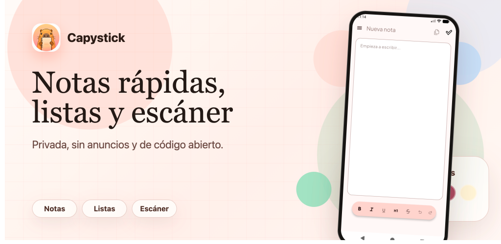
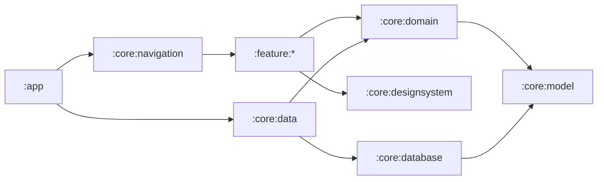

<p align="center">
  
</p>

<p align="center">
  Una app de notas para Android, rápida, organizada y sin anuncios.
</p>

<p align="center">
  <a href="https://github.com/rjahir-rv/Capystick/actions/workflows/ci.yml"></a>
  
  <a href="https://github.com/rjahir-rv/Capystick/blob/main/LICENSE"></a>
  
  
</p>

## Qué ofrece

- Notas de texto enriquecido con formato, deshacer y rehacer.
- Listas de tareas con elementos marcables.
- Escáner con CameraX y reconocimiento de texto mediante ML Kit.
- Colecciones, favoritos, búsqueda y papelera.
- Protección de notas con biometría o credenciales del dispositivo.
- Widgets configurables para notas recientes o colecciones.
- Copias de seguridad en JSON y exportación de notas a archivos de texto.
- Temas claro, oscuro y del sistema, con diferentes paletas de color.
- Interfaz en español e inglés, adaptada a orientación vertical y horizontal.
- Datos de notas almacenados localmente con Room.

## Capturas y funcionamiento

Capystick reúne la creación, consulta y organización de notas en una navegación adaptativa. En teléfonos utiliza un panel lateral; en horizontal cambia a un rail de navegación. Las notas protegidas no se muestran en los widgets.

> [!NOTE]
> El proyecto integra Firebase Analytics y Crashlytics para telemetría y reportes de fallos. El contenido de las notas se persiste en la base de datos local de la aplicación.

## Tecnologías

- Kotlin y Jetpack Compose con Material 3.
- Navigation 3 para navegación tipada y back stacks guardables.
- Room para persistencia local.
- Hilt y KSP para inyección de dependencias.
- Coroutines, Flow y StateFlow para estado reactivo.
- CameraX y ML Kit Text Recognition para el escáner.
- Glance para widgets de Android.
- DataStore para configuración de widgets y preferencias.
- Firebase Analytics y Crashlytics.
- Gradle Kotlin DSL, catálogo de versiones y plugins de convención.

## Arquitectura

El proyecto está dividido en 15 módulos y sigue una separación por capas y funcionalidades:



| Área | Responsabilidad |
| --- | --- |
| `app` | Entrada Android, integración de Firebase, actualizaciones y widgets del sistema |
| `core:model` | Modelos compartidos sin dependencias Android |
| `core:domain` | Contratos de repositorio y lógica de dominio |
| `core:data` | Implementaciones, mapeos, exportación, OCR y preferencias |
| `core:database` | Room, entidades y DAOs |
| `core:designsystem` | Tema y componentes Compose reutilizables |
| `core:navigation` | Navigation 3 y composición de pantallas |
| `feature:*` | Notas, listas, colecciones, escáner, ajustes, backup y widgets |

## Ejecutar el proyecto

### Requisitos

- Android Studio con soporte para el SDK de Android 37.
- JDK 21 para Gradle (el código se compila con compatibilidad Java 17).
- Android SDK 37 y un dispositivo o emulador con Android 9 (API 28) o superior.
- Un proyecto de Firebase configurado para `com.capystick.app`.

### Configuración

1. Clona el repositorio:

   ```bash
   git clone https://github.com/rjahir-rv/Capystick.git
   cd Capystick
   ```

2. Descarga el archivo `google-services.json` desde Firebase y colócalo en `app/google-services.json`. El archivo está ignorado por Git y no debe versionarse.
3. Abre el proyecto en Android Studio y sincroniza Gradle.
4. Ejecuta la configuración `app` en un dispositivo o emulador.

También puedes compilar desde la terminal:

```bash
./gradlew assembleDebug
```

En Windows usa `gradlew.bat assembleDebug`.

## Calidad y pruebas

El flujo de CI ejecuta Ktlint, compila el APK de depuración y corre todas las pruebas unitarias en cada cambio relevante.

```bash
./gradlew ktlintCheck testDebugUnitTest assembleDebug
```

Las pruebas actuales cubren, entre otros puntos, serialización de backups y checklists, geometría de recorte, contenido de widgets y coordinación de actualizaciones dentro de la app.

## Contribuir

1. Crea una rama desde `main`.
2. Mantén las dependencias entre capas: las funcionalidades consumen contratos de `core:domain`; las implementaciones viven en `core:data`.
3. Agrega o actualiza pruebas para cualquier cambio de comportamiento.
4. Ejecuta Ktlint, pruebas unitarias y una compilación debug antes de abrir el pull request.
5. Usa el template de pull request y explica cómo verificaste el cambio.

Los reportes de errores y propuestas son bienvenidos en [GitHub Issues](https://github.com/rjahir-rv/Capystick/issues).

## Estado del proyecto

Capystick está en desarrollo activo. La versión configurada actualmente es `0.9.0`, por lo que pueden existir cambios de interfaz, almacenamiento o comportamiento antes de la versión estable.

## Licencia

Capystick se distribuye bajo los términos de la [Licencia MIT](https://github.com/rjahir-rv/Capystick/blob/main/LICENSE). Puedes usar, copiar, modificar y distribuir el software respetando el aviso de copyright y los términos incluidos en la licencia.
